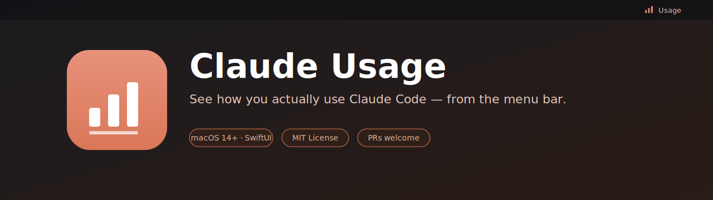
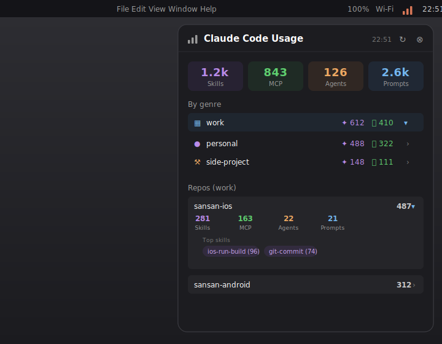

<p align="center">
  
</p>

<h1 align="center">Claude Usage Menubar</h1>

<p align="center">
  <strong>See how you actually use Claude Code — from the menu bar.</strong><br/>
  A tiny, native SwiftUI menu-bar app that reads your local Claude Code usage logs and shows skill, MCP, sub-agent, and prompt counts at a glance.
</p>

<p align="center">
  
  
  
  
  
  <a href="https://github.com/akidon0000/claude-usage-menubar/actions/workflows/ci.yml"></a>
</p>

<p align="center">
  <a href="README.md">English</a> ·
  <a href="README.ja.md">日本語</a>
</p>

---

<p align="center">
  
</p>

## ✨ Why?

Claude Code quietly accumulates a lot of usage signal — which skills you lean on, which MCP servers you hit, how often you reach for sub-agents, how many prompts you send — but that data just sits in JSON files under `~/.claude/usage/`. **Claude Usage Menubar** surfaces it: it lives in the menu bar, reads those files, and rolls them up into a popover you can glance at any time. No servers, no telemetry, no network — everything stays on your Mac.

## 🚀 Features

- 📊 **Menu-bar resident** — a bar-chart icon, no Dock clutter (`LSUIElement = YES`).
- 🔢 **At-a-glance totals** — Skills, MCP, Agents, and Prompts as four summary cards.
- 🗂 **Grouped by genre** — `work` / `personal` / `side-project` / other, tap to filter.
- 📦 **Per-repo breakdown** — expand any repo to see its skill / MCP / agent / prompt counts plus top skills and top MCP tools.
- 🔒 **100% local** — reads `~/.claude/usage/<org>/<repo>.json` directly; nothing leaves your machine.
- 🔄 **One-click refresh** — re-read the logs whenever you want.

## 🧰 Requirements

- macOS **14.0** Sonoma or later
- Xcode **16+** / Swift **6.0** toolchain (to build)
- Claude Code usage logs under `~/.claude/usage/` (this is what the app visualizes)

## 📦 Install

### Option 1: Build & install with the script (recommended)

```bash
git clone https://github.com/akidon0000/claude-usage-menubar.git
cd claude-usage-menubar

./build.sh
```

`build.sh` runs a release build, packages a `Claude Usage.app` bundle into `/Applications`, ad-hoc signs it, and launches it.

### Option 2: Run from source

```bash
swift run -c release
```

> [!NOTE]
> The app is **ad-hoc signed** (`codesign --sign -`). On first launch macOS may warn that the developer can't be verified — right-click the app and choose **Open**, or allow it in **System Settings → Privacy & Security**.

## 🖱 Usage

1. Click the bar-chart icon in the menu bar.
2. The top row shows your all-time totals: **Skills**, **MCP**, **Agents**, **Prompts**.
3. Tap a **genre** row (`work`, `personal`, …) to filter the repo list below it.
4. Tap a **repo** row to expand it and see its per-category counts, top skills, and top MCP tools.
5. Hit **↻** to re-read the logs, or **⊗** to quit.

## 🗂 Data source

The app scans the following layout and decodes every `*.json` it finds:

```
~/.claude/usage/
└── <org>/
    └── <repo>.json
```

Each file is expected to carry `_repo`, `_org`, `_genre`, a `tools` map (keys prefixed `Skill:`, `MCP:`, `Subagent:`), and a `session` block (`Prompt`, `InstructionLoad`). Missing fields fall back to sensible defaults, so partial files won't crash the app.

## 🏗 Architecture

```
ClaudeUsageMenubar/Sources/
├── App.swift          # @main, AppDelegate, NSStatusItem + NSPopover wiring
├── PopoverView.swift  # SwiftUI popover: summary cards, genre rows, repo rows
└── UsageStore.swift   # ObservableObject: scans ~/.claude/usage, decodes JSON, aggregates
```

- `UsageStore` is the single source of truth: it reads the JSON files, builds `RepoUsage` / `GenreSummary` values, and publishes them.
- `PopoverView` is pure presentation, driven by the store.
- `AppDelegate` owns the status item and popover lifecycle; the app runs as an accessory (no Dock icon).

## 🤝 Contributing

PRs welcome! See [CONTRIBUTING.md](CONTRIBUTING.md) for dev setup, coding style, and the PR checklist.

A few open ideas:

- A real `.icns` app icon.
- Launch-at-login toggle.
- A time-range filter (today / this week / all time).
- Edit-metrics (added / deleted lines) visualization — the data is already decoded.

## 📄 License

[MIT](LICENSE) © akidon0000
